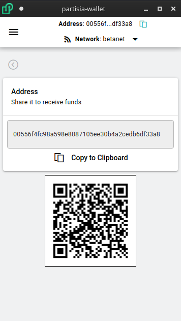

# Create New Wallet Address

There are five types of ways create a new partisia address:
* Mnemonic Phrase
* Private Key
* Twitter Authentication
* Ledger Hardware Wallet
* Backup Keystore File

### Mnemonic Phrase
By default the mnemonic phrase will be 12 words, but this increases in setting->General up to (12, 15, 18, 21, 24)

### Private Key
The private key should be a hexadecimal string with a length of 64

### Twitter Authentication
You can obtain a Partisia Address through Twitter.  This is done in cooperation with [Torus Labs](https://tor.us/).
Simply authenticate through twitter and the Wallet will automatically create your private key and address for you.

### Ledger Hardware Wallet
Currently we are in the Ledger waitlist to be accepted as an official ledger-live app but until then you can still use a ledger hardware wallet if you are willing to set the device in developer mode and manually load the ADPU.  Documentation can be found here: [ledger-partisia-docs](https://partisiablockchainapplications.github.io/ledger-partisia-docs/)

### Backup Keystore File
You can also generate and restore your wallet with an encrypted keystore file. To generate the keystore file select the `Export to a Encrypted File` option in `Menu -> Backup`

## Receive funds
To view your address simply look at the header row of the wallet or click the receive button to show your full address and corresponding QR code

