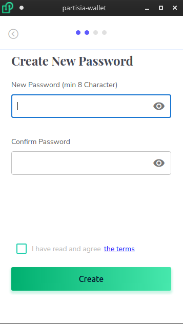
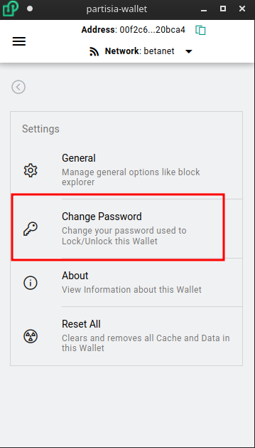

# Initial Setup

Before you are able to use your wallet, you must password protect it. Additionally this password will be required to be entered before anytime your private key is used.

To setup your password, follow the steps when you first load your wallet.

### Reset Password
This password can be reset later on in settings -> Change Password:

