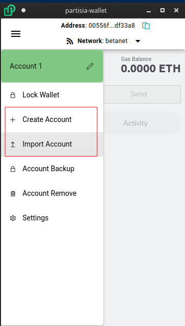

# Multiple Accounts

You can have multiple accounts at the same time in the wallet. From the menu button click either `Create Account` or `Import Account`

This will then allow you to Import or Create a new account.

> * Note: if you want to use your Twitter as your wallet you will need to select `Import Account`