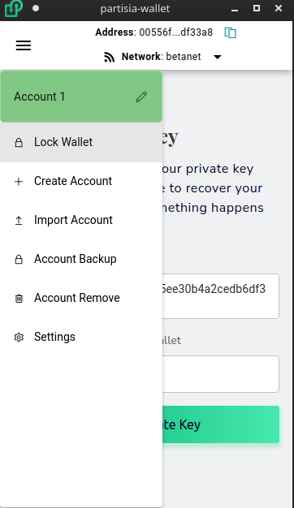

# Wallet Backup
It is very important to always keep a safely secured backup of all your private keys.  This will be the only way to recover your funds in the event anything happens to your computer.

To take a backup, select the account you wish to backup and then from the menu select `Account Backup`

You will be prompted to input your password and afterwards your private key or mnemonic phrase will be shown. You also have the option to export your keys to an encrypted keystore file if you prefer not working with the keys directly.