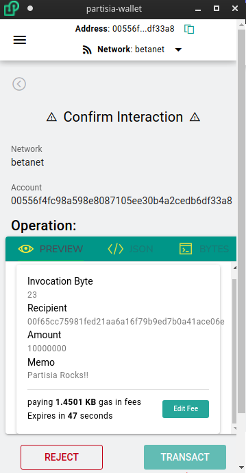

# Confirm Screen

Before any transaction you will get prompted a review screen like the above. It is important to carefully review the information in this screen to make sure you are sending the transaction you intend.

Some important things to consider:
* Make sure the `Network` is correct
* Make sure the receiving `Account` is correct
* Make sure the details of the Operation are correct.
    > Please note that if you are sending a token that the numbers are shown without decimals

### Edit Fee
You can edit the fee you pay for the transaction and increase or decrease depending on preference

### Add more time
If your time expires you can click `Add more time` to reset the clock. There is no harm in doing this

