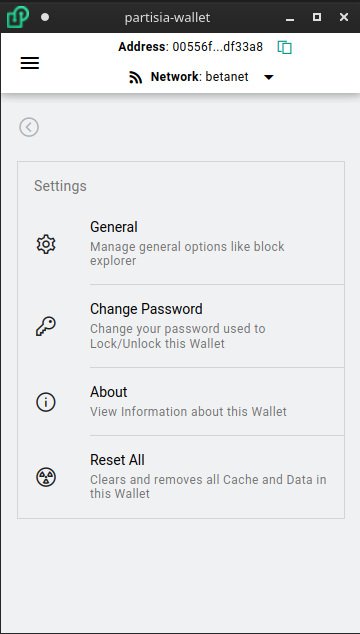

# Wallet Settings

Access Wallet Settings from the Menu

* General:
   * Open as Popout Window: When clicking extension icon in toolbar opens a separate window instead of popup window.  This is nice if you need to move back and forth between webpages and windows to input information
   * Mnemonic Phrase: This is how many words in the Mnemonic Phrase. The more words the more entropy making brute force attacks more difficult. Choose between (12, 15, 18, 21, 24)
   * Wallet Timeout: This is how long of inactivity before the Wallet automatically Locks and requiring a password to be entered
   * Transaction Valid Time: Each transaction has an expiry time before the blockchain no considers the transaction valid. This is how long the expiration is. A longer time period gives you more time to review before sending but a shorter time period is helpful to prevent replay attacks.
   * Block Explorer Account Url: This allows you to customize the base url for viewing on chain account addresses
   * Block Explorer Transaction Url: This allows you to customize the base url for viewing on chain transactions
* Change Password: Reset your Wallet password
* About: Displays Wallet version and link to source code
* Reset All: Allows clear out all storage and cache in the wallet. It is critical to backup your wallet first before doing this, as that is the only way to recover your wallet later